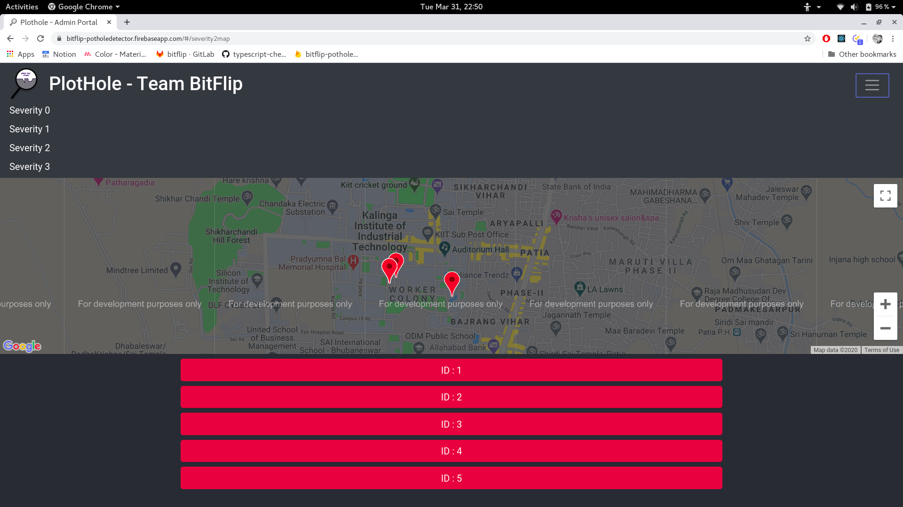

# Plothole - Authority Admin Dashboard

The dashboard to be used by authorities deployed using firebase.

## Development Setup and Dependencies

* `npm install` to install all the dependencies
* `npm start` to start the dev server
* `npm run build` to build 
* `firebase deploy` to deploy the current build to firebase

Just a single component `Home.js`. 

Makes a `.on` call to the firebase instance to get the data asynchronously on change.

## Screenshots

